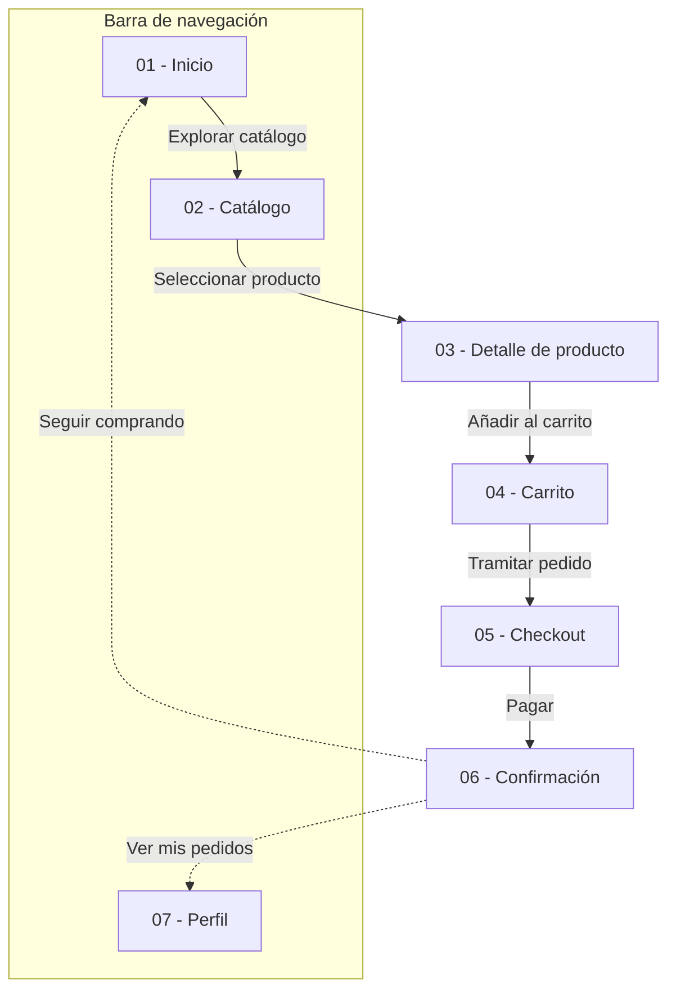

# Documentación de la interfaz — Kidwear

## 1. Justificación del diseño

### 1.1 Importancia del diseño centrado en el usuario
Kidwear es una cadena de tiendas físicas de ropa y calzado infantil (0 a 14 años) que aborda su primer canal móvil Android. Su público principal está compuesto por madres, padres, abuelos y compradores de regalos. Este perfil se caracteriza por:
* Disponer de poco tiempo libre.
* Manejar el dispositivo habitualmente con una sola mano mientras atienden a sus hijos o realizan otras tareas simultáneas.
* Experimentar una alta incertidumbre a la hora de seleccionar tallas debido al rápido crecimiento de los niños y la disparidad entre marcas.

Aplicar el diseño centrado en el usuario (DCU) y los estándares de Material Design 3 garantiza una interfaz ergonómica, con botones dentro del alcance del pulgar, áreas táctiles amplias (mínimo 48×48 dp) y herramientas directas que resuelvan la duda de la talla antes de formalizar la compra, reduciendo la fricción y el abandono del carrito.

### 1.2 Objetivos y metas del proyecto
1. **Eficiencia en la compra:** Permitir que un usuario localice una prenda, elija su talla y complete el flujo de compra en menos de **2 minutos (120 segundos)**.
2. **Reducción de dudas con el tallaje:** Lograr que más del **85% de los usuarios** seleccione la talla correcta sin abandonar la ficha de producto, apoyados por una guía de tallas accesible en un solo toque mediante bottom sheet.
3. **Ergonomía y accesibilidad:** Conseguir una tasa de éxito superior al **90% en navegación con una sola mano**, asegurando que todas las acciones críticas cumplan el estándar de área táctil mínima de **48×48 dp** y contraste visual **WCAG AA (≥ 4,5:1)**.

### 1.3 Beneficios esperados
* **Para el usuario:** Confianza inmediata al seleccionar tallas, rapidez en compras rutinarias y un proceso de pago guiado y claro, accesible tanto para usuarios digitales habituales como para abuelos menos familiarizados con compras móviles.
* **Para el negocio:** Incremento en la tasa de conversión móvil, fidelización del cliente físico en el entorno digital y reducción drástica de costes logísticos derivados de devoluciones y cambios por error de talla.

## 2. Investigación y análisis de usuarios

### 2.1 Datos demográficos y segmentación
El público objetivo de Kidwear se divide en dos segmentos principales:
* **Padres y madres jóvenes (28 a 42 años):** Usuarios habituales de smartphones, compran en momentos de descanso breve, trayectos o mientras atienden a sus hijos. Buscan rapidez, claridad en el stock y filtros automáticos por edad y temporada.
* **Compradores de regalos y abuelos (55 a 70 años):** Compran ropa infantil de forma puntual (cumpleaños, Navidad). Necesitan textos legibles, jerarquía visual evidente, botones táctiles generosos y asistencia directa para acertar la talla sin necesidad de conocer las medidas corporales exactas del menor.

### 2.2 Personas

#### Persona 1: Laura Morales (34 años) — Madre y compradora recurrente
* **Perfil:** Arquitecta y madre de dos niños (18 meses y 5 años). Compra habitualmente desde su smartphone con una sola mano mientras cuida de los pequeños o viaja en transporte público.
* **Objetivos:** Encontrar ropa cómoda y duradera rápidamente, filtrando por rango de edad exacto y completando la compra en dos minutos sin registros extensos.
* **Frustraciones:** Tablas de medidas complejas que exigen cinta métrica, procesos de compra con demasiados pasos y menús donde los botones son demasiado pequeños para pulsar con el pulgar.

#### Persona 2: Antonio Gómez (67 años) — Abuelo comprador de regalos
* **Perfil:** Jubilado, abuelo de una nieta de 4 años. Utiliza su móvil Android para mensajería y compras ocasionales.
* **Objetivos:** Comprar un conjunto infantil para el cumpleaños de su nieta con la seguridad de que le servirá de talla, identificando con claridad el precio final y los pasos a seguir.
* **Frustraciones:** Textos pequeños con bajo contraste, interfaces oscuras poco legibles, temor a equivocarse en el cobro y falta de mensajes claros de confirmación al terminar un pedido.

### 2.3 Análisis de la competencia

| Competidor | Qué hace bien | Qué hace mal | Qué nos llevamos para Kidwear |
|---|---|---|---|
| **Mayoral** | Excelente categorización por tramos de meses y años en catálogo. | Interfaz móvil muy recargada, con demasiados banners publicitarios y botones pequeños. | Estructuración directa de categorías por edad (0-24 m, Niña, Niño) manteniendo un diseño visual limpio. |
| **Zara Kids** | Fotografía de producto cuidada y diseño moderno y minimalista. | Contraste tipográfico deficiente en fichas de producto; selector de talla poco intuitivo para no iniciados. | Ficha de producto enfocada en imágenes claras, pero garantizando contraste alto (WCAG AA ≥ 4,5:1) y botones táctiles evidentes. |
| **H&M Kids** | Guía de tallas interactiva con equivalencias de altura y peso. | Proceso de checkout excesivamente largo con formularios densos que saturan en pantalla pequeña. | Guía de tallas accesible en un solo clic mediante *bottom sheet* desplegable, sin perder el contexto del producto. |

### 2.4 Insights y hallazgos clave
1. **Uso con una sola mano en movimiento:** Los usuarios sostienen el teléfono con el pulgar mientras sujetan a sus hijos o bolsas.  
   * *Decisión de diseño:* Situar los botones principales de acción (*Call to Action*) y la barra de navegación en el tercio inferior de la pantalla, con áreas táctiles mínimas de 48×48 dp.
2. **Incertidumbre crítica con el tallaje:** La principal causa de abandono y devolución es no saber qué talla equivale a la edad real del niño.  
   * *Decisión de diseño:* Integrar un botón directo «Guía de tallas» en la ficha de producto que abre un *bottom sheet* contextual con rangos de edad y altura en centímetros.
3. **Miedo al cobro accidental o error en el pedido:** Compradores mayores y personas con prisa necesitan certidumbre total de lo que ocurre con su dinero.  
   * *Decisión de diseño:* Pantalla de confirmación con número de pedido, resumen del importe y opción de deshacer (*Snackbar*) ante acciones críticas como eliminar artículos del carrito.
4. **Sobrecarga cognitiva en la búsqueda:** Las categorías genéricas de adultos ("Pantalones", "Camisas") no sirven; los padres compran según la etapa de crecimiento.  
   * *Decisión de diseño:* Pantalla de inicio estructurada con accesos prioritarios por tramos de edad (*Bebés*, *Peques*, *Grandes*) y *filter chips* combinables en el catálogo.

   ## 3. Diseño de la interfaz

### 3.1 Mapa de navegación

A continuación se representa la arquitectura de la información y el flujo de navegación principal, que incluye las siete pantallas obligatorias y los componentes modales interactivos:

### 3.2 Wireframes

A continuación se presentan los wireframes de baja fidelidad en escala de grises diseñados para una resolución base de 360×800 dp (Android Compact):

#### 01. Inicio

#### 02. Catálogo

#### 03. Detalle del producto

#### 04. Carrito

#### 05. Checkout

#### 06. Confirmación

#### 07. Perfil

### 3.3 Guía de estilo Material Design 3

El sistema visual de «Kidswear» implementa los estándares de **Material Design 3 (M3)**. Todos los tokens técnicos (esquemas de color, tipografía y métricas espaciales) se encuentran centralizados en el archivo `diseno/estilos.json`.

#### 1. Sistema cromático y color semilla
* **Color semilla (*Source Color*):** `#B85D43` (Terracota cálido).
  * **Justificación:** Se seleccionó un tono terracota cálido para transmitir cercanía, confort y modernidad, propio de las marcas contemporáneas de moda infantil y calzado, evitando colores sobresaturados convencionales y cumpliendo la pauta de prescindir de tonos verdes.
* **Tokens semánticos de color:**
  * **Modo Claro (*Light Theme*):** `primary`: `#8F4B38`, `onPrimary`: `#FFFFFF`, `primaryContainer`: `#FFDBD1`, `onPrimaryContainer`: `#723523`, `secondary`: `#77574E`, `onSecondary`: `#FFFFFF`, `tertiary`: `#6C5D2F`, `onTertiary`: `#FFFFFF`, `surface`: `#FFF8F6`, `onSurface`: `#231917`, `error`: `#BA1A1A`, `onError`: `#FFFFFF`.
  * **Modo Oscuro (*Dark Theme*):** `primary`: `#FFB5A0`, `onPrimary`: `#561F0F`, `primaryContainer`: `#723523`, `onPrimaryContainer`: `#FFDBD1`, `secondary`: `#E7BDB2`, `onSecondary`: `#442A22`, `tertiary`: `#D9C58D`, `onTertiary`: `#3B2F05`, `surface`: `#1A110F`, `onSurface`: `#F1DFDA`, `error`: `#FFB4AB`, `onError`: `#690005`.

#### 2. Auditoría de contraste y accesibilidad (WCAG 2.1 AA)
De acuerdo con las pautas WCAG 2.1, todo elemento interactivo o de texto debe superar el contraste mínimo de **4.5:1** (nivel AA) y **3.0:1** en componentes gráficos. Se han verificado las 12 parejas `color` / `on-color`:

| Esquema | Pareja de color | Código Color | Código On-Color | Ratio de contraste | Cumplimiento WCAG |
| :--- | :--- | :---: | :---: | :---: | :---: |
| **Claro** | `primary` / `onPrimary` | `#8F4B38` | `#FFFFFF` | **6.50:1** | Supera AA (mín. 4.5:1) |
| **Claro** | `primaryContainer` / `onPrimaryContainer` | `#FFDBD1` | `#723523` | **7.25:1** | Cumple AAA (mín. 7.0:1) |
| **Claro** | `secondary` / `onSecondary` | `#77574E` | `#FFFFFF` | **6.45:1** | Supera AA (mín. 4.5:1) |
| **Claro** | `tertiary` / `onTertiary` | `#6C5D2F` | `#FFFFFF` | **6.47:1** | Supera AA (mín. 4.5:1) |
| **Claro** | `surface` / `onSurface` | `#FFF8F6` | `#231917` | **16.36:1** | Cumple AAA (mín. 7.0:1) |
| **Claro** | `error` / `onError` | `#BA1A1A` | `#FFFFFF` | **6.46:1** | Supera AA (mín. 4.5:1) |
| **Oscuro** | `primary` / `onPrimary` | `#FFB5A0` | `#561F0F` | **7.74:1** | Cumple AAA (mín. 7.0:1) |
| **Oscuro** | `primaryContainer` / `onPrimaryContainer` | `#723523` | `#FFDBD1` | **7.25:1** | Cumple AAA (mín. 7.0:1) |
| **Oscuro** | `secondary` / `onSecondary` | `#E7BDB2` | `#442A22` | **7.70:1** | Cumple AAA (mín. 7.0:1) |
| **Oscuro** | `tertiary` / `onTertiary` | `#D9C58D` | `#3B2F05` | **7.73:1** | Cumple AAA (mín. 7.0:1) |
| **Oscuro** | `surface` / `onSurface` | `#1A110F` | `#F1DFDA` | **14.42:1** | Cumple AAA (mín. 7.0:1) |
| **Oscuro** | `error` / `onError` | `#FFB4AB` | `#690005` | **7.72:1** | Cumple AAA (mín. 7.0:1) |

#### 3. Rejilla y sistema espacial (*Layout Grid*)
* **Columnas:** 4 columnas fluidas en disposición móvil con medianil (*gutter*) de 16 dp.
* **Márgenes de pantalla:** 16 dp en los bordes laterales del dispositivo.
* **Malla modular:** Múltiplos de 8 dp para espaciados, rellenos (*padding*) y dimensiones estructurales (con paso de 4 dp para ajustes finos).
* **Áreas táctiles mínimas:** Todos los componentes interactivos respetan el área mínima de **48×48 dp**, garantizando la operabilidad táctil accesible y ergonómica.